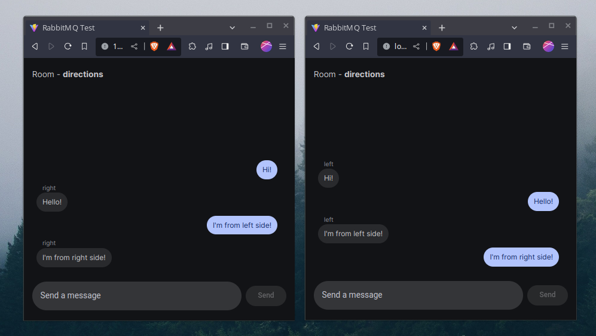

# RabbitMQ Test

Utilizing RabbitMQ for Message Queuing Chat System with Material Design 3 UI

## Screenshot



## Getting Started (Linux)

### Install RabbitMQ Server

```bash
sudo apt-get install rabbitmq-server
```

### Enable RabbitMQ Web MQTT Plugin

```bash
sudo rabbitmq-plugins enable rabbitmq_web_mqtt
```

### Install dependencies

```bash
npm install
```

or with bun:

```bash
bun install
```

### Run the dev server

```bash
npm run dev
```

or with bun:

```bash
bun run dev
```

## License

This project is licensed under the BSD 3-Clause License - see the [LICENSE](LICENSE) file for details

## Author 

* [mavyfaby](https://github.com/mavyfaby) (Maverick Fabroa)